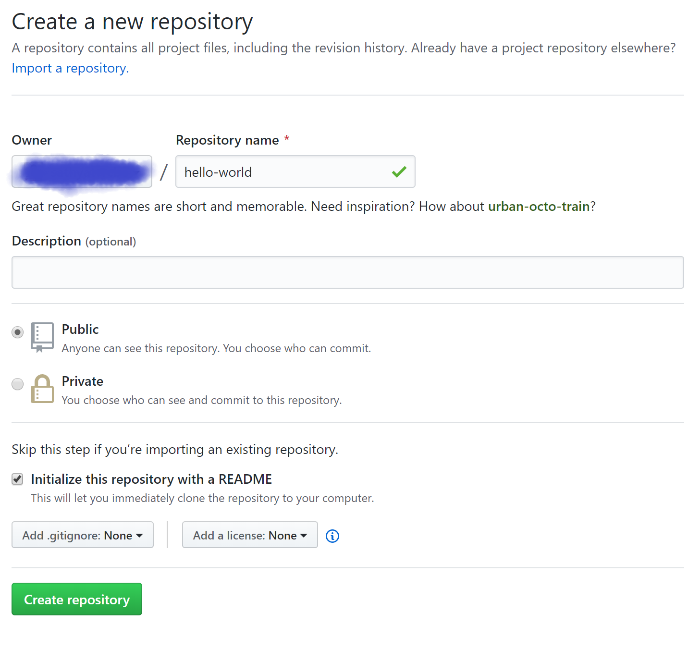
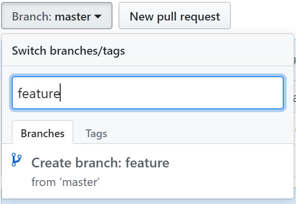

# தமிழில் கற்போம் கிட்ஹப்(GitHub) 

கணினி மென்பொருள் நிரலாக்கத்துறையில் முதன் முதலில் ஏதேனும் கற்கும்பொழுது `ஹலோ வேர்ல்ட்` என்று சொல்லி தொடங்குவது மரபாகும். நாமும் மரபின் வழி கிட்ஹப் தளத்தைப் பற்றி கற்க தொடங்குவோம்.

இங்கே நீங்கள் கீழ்கண்டவற்றை கற்பீர்கள்:

- களஞ்சியங்களை உருவாக்க மற்றும் பயன்படுத்த 
- கிளைகளை தொடங்க மற்றும் நிர்வகிக்க 
- கோப்புகளை மாற்றம் செய்து அவற்றை கிட்ஹப்பில் ஒப்படைக்க
- இழுவை கோரிக்கைகளை உருவாக்க மற்றும் சேர்க்க

## கிட்ஹப் என்றால் என்ன?
கிட்ஹப் என்பது நிரல் கோப்புகளை பதிப்பு கட்டுப்பாடு செய்வதற்கும் நிரல் கோப்புகள் மீது உடனுழைப்பு செய்வதற்கும் நிரல் கோப்புகளை சேமித்து வைக்கும் தளமாகும். உலகின் எம்மூலையில் இருப்போரோடும் ஒரு திட்டத்தில் உடனுழைப்பு செய்ய இத்தளம் உதவுகிறது.

இங்கே நீங்கள் களஞ்சியங்கள், கிளைகள், ஒப்படைப்புகள், இழுவை கோரிக்கைகள் போன்ற கிட்ஹப்பின் அடிப்படைகளைப் பற்றி அறியலாம். நீங்கள் "Hello World" என்றொரு களஞ்சியத்தை உருவாக்குவீர்கள். அக்களஞ்சியத்தில் இழுவை கோரிக்கை ஒன்றை உருவாக்கி நீங்கள் செய்த மாற்றங்களை மறுசீராய்வு செய்வீர்கள்.

### நிரலாக்கம் தேவையில்லை
இப்பயிற்சியை நிறைவு செய்ய இணைய இணைப்பும் ஒரு கிட்ஹப் கணக்கும் போதுமானது. நிரலாக்கம் செய்ய தெரிந்திருக்க வேண்டும் என்று அவசியம் இல்லை.

> துணுக்கு: இப்பக்கத்தை வேறொரு உலாவி சாளரத்தில் திறந்து கொள்ளவும். இவ்வாறு செய்வதன் மூலம் நீங்கள் இப்பக்கத்தை பார்த்துக்கொண்டே கீழ் சொல்லப்பட்டிருக்கும் பயிற்சிகளை செய்ய இயலும்.

## முதற்படி - களஞ்சியத்தை உருவாக்குக
ஒரு களஞ்சியம் என்பது பொதுவாக இரு திட்டத்தை ஒழுங்கமைக்க பயன்படுத்தப்படுகிறது. நீங்கள் உங்கள் களஞ்சியத்தில் அடைவைகள், கோப்புகள், படங்கள், காணொளிகள் மாறும் இதர தகவல்களையும் சேர்த்து வைக்க முடியும். நீங்கள் நிர்வகிக்கும் திட்டத்தைப்பற்றி விளக்க README எனும் கோப்பை உங்கள் களஞ்சியத்துடன் இணைக்க கிட்ஹப் பரிந்துரைக்கிறது.

உங்கள் சிந்தனைகளையும் எண்முறை வளங்களையும் சேமிக்கவும் பகிரவும் களஞ்சியங்களை பயன்படுத்தலாம். உங்கள் திட்டத்தின் மீதான விவாதங்களையும் இக்களஞ்சியத்தின் மீது நடத்தலாம். இப்பொழுது "hello world" என்றொரு களஞ்சியத்தை உருவாக்கி மேற்கூறியவற்றை எவ்வாறு செய்வது என்று பாப்போம்.

### புதிய களஞ்சியத்தை உருவாக்க
- கிட்ஹப் பக்கத்தின் மேல்புறம் வலது மூலையில் சிறுபடம் ஒன்றிருக்கும். அதனருகில் இருக்கும் *+* குறியீட்டை அழுத்தவும். அதன் பின்பு `New Repository` என்பதை அழுத்தவும்.  
- `hello-world` என்று பெயரிடவும்
- சிறுகுறிப்பு எழுதவும்
- `Initialize this repository with a README` என்பதை தேர்வு செய்யவும்.
- `Create repository` என்பதை அழுத்தவும் 

## இரண்டாம் படி - கிளையை உருவாக்குக
ஒரு களஞ்சியத்தின் வெவ்வேறு பதிப்புகளின் மீது பங்களிப்பாற்ற  கிளைகள் உதவுகின்றன. ஒரு களஞ்சியத்தின் ஒவ்வொரு கிளையும் ஒவ்வொரு பதிப்பாகும். 

வழக்கமாக நாம் உருவாக்கும் களஞ்சியத்தில் `master` எனும் ஒரு கிளை மட்டுமே இருக்கும். இக்கிளையே உங்கள் களஞ்சியத்தின் உறுதியான பாதிப்பாகும். நீங்கள் இக்கிளையில் ஏதேனும் மாற்றங்கள் செய்ய நினைத்தால் அதை நேரிடையாக செய்யாது இன்னொரு கிளையில் செய்வது வழக்கமாகும்.

ஒரு புதிய கிளையை ஏற்கனவே இருக்கும் ஒரு கிளையில் இருந்தே உருவாக்க முடியும். இப்பொழுது நாம் `master` கிளையில் இருந்து இன்னொரு கிளையை உருவாக்குவோம்.

### புதிய கிளையை உருவாக்க 
- நீங்கள் உருவாக்கிய `hello-world` எனும் களஞ்சியத்திற்கு செல்லவும்
- `branch : மாஸ்டர்` எனும் கீழ்விழும் பட்டியலை அழுத்தவும் 
- கீழ்விழும் பட்டியல் வந்தவுடன் அதிலிருக்கும் எழுத்துப்பெட்டியில் தங்களது புதிய கிளையின் பெயரை `feature` என உள்ளிடவும்.
- பின்பு `create branch` என்பதனை அழுத்தவும்.   

இப்பொழுது உங்கள் களஞ்சியத்தில் இரண்டு கிளைகள் உள்ளன. ஒன்று `master`. இன்னொன்று `feature`. மேற்கூறிய இரு கிளைகளும் ஒன்றுபோல் வேற்றுமையின்றி இருக்கும். மூன்றாம் படியில் நாம் புதிதாக உருவாக்கிய கிளையில் சிறு மாற்றங்களை செய்வோம்.  

## மூன்றாம் படி - மாற்றம் செய்து ஒப்படைத்தல்
இப்பொழுது நீங்கள் `feature` எனும் கிளையில் உள்ளீர்கள். இந்த கிளைக்கும் `master` கிளைக்கும் இதுவரை எவ்வேறுபாடும் இல்லை. நாம் இப்பொழுது  `feature` கிளையில் சிறு மாற்றங்கள் செய்வோம்.

கிட்ஹப்பில் நாம் செய்த மாற்றங்களை சேமிக்க 'ஒப்படைத்தல்' எனும் செயலை செய்ய வேண்டும். ஒவ்வொரு ஒப்படைப்பிற்கும் ஒரு ஒப்படைத்தல் செய்தியை வழங்க வேண்டும். இந்த ஒப்படைத்தல் செய்தியானது நாம் செய்த மாற்றத்தை பிறர் புரிந்துகொள்ள உதவும்.

### மாற்றம் செய்து ஒப்படைத்தல் 
- `README.md` எனும் கோப்பை அழுத்தவும்
- பக்கத்தின் மேல் புறத்தில் இருக்கும் கரிக்கோல் உருவத்தை அழுத்தவும்
- எழுதியில் உங்களைப்பற்றி சிறிது எழுதவும் 
- நீங்கள் செய்த மாற்றத்தை விளக்கும் வகையில் ஒப்படைப்பு செய்தியை  `Commit Changes` என்ற எழுத்துப்பெட்டியில் உள்ளிடவும்
- `Commit Changes` எனும் பொத்தானை  அழுத்தவும்

நீங்கள் மேலே கூறியது போல செய்த மாற்றங்கள் `feature` கிளையில் உள்ள README கோப்பில் மட்டுமே இருக்கும். `master` கிளையிலுள்ள README கோப்பில் இம்மாற்றங்கள் இராது. இப்பொழுது உங்கள் `feature` கிளையானது `master` கிளையில் இருந்து வேறுபட்டிருக்கிறது.

## நான்காம் படி - இழுவை கோரிக்கையை உருவாக்கவும்
நீங்கள் செய்த மாற்றங்களை பிறருக்கு தெரிவிக்கவும் நீங்கள் செய்த மாற்றங்களை `master` கிளையில் சேர்க்கவும், மற்றவர்களை சீராய்வு செய்ய அழைக்கவும் இழுவை கோரிக்கையை உருவாக்க வேண்டும். இழுவை கோரிக்கையை நீங்க உருவாக்கியவுடன் உங்களால் இரு கிளைகளுக்கு நடுவில் இருக்கும் மாற்றங்களை காண முடியும். உங்கள் மாற்றங்களை சீராய்வு செய்ய சீராய்வாளர்களை அழைக்கமுடியும். சீராய்வாளர்கள் உலகின் எந்த மூலையில் இருந்து வேண்டுமானாலும் சீராய்வு செய்ய முடியும்.

### மூன்றாம் படியில் செய்த மாற்றங்களுக்கு இழுவை கோரிக்கை
#### இழுவை கோரிக்கையை  உருவாக்குதல் 
- உங்கள் களஞ்சியத்திற்கு செல்லவும். 
- இப்பக்கத்தில் `Pull Request` என்றிருக்கும் தாவலை அழுத்தவும்.
- பின்பு `New Pull Request` என்ற பொத்தானை அழுத்தவும்.

#### கிளையை தேர்ந்தெடுக்கவும் 
- `base` என்ற இடத்தில் `master` எனவும் `compare` என்ற இடத்தில `feature` எனவும் குறிக்கவும்

#### வேற்றுமைகளை காணவும் 
- மேற்சொன்னவாறு கிளைகளை தேர்ந்தெடுத்ததும் இரு கிளைகளுக்குமான வேற்றுமைகளை நீங்கள் அப்பக்கத்தின் கீழ்ப்பகுதியில் காணலாம்.
 
#### தலைப்பிடவும்
- பொருத்தமான தலைப்பையும் இவ்விழுவை கோரிக்கையைப் பற்றி விளக்கத்தையும் இப்பக்கத்தில் இருக்கும் எழுத்துப்பெட்டிக்குள் எழுதவும்.
- பின்பு `Create Pull Request` எனும் பொத்தானை மறுபடி அழுத்தவும். 

உங்களுடைய இழுவை கோரிக்கை இப்போது தயார்.

படி ஐந்து - இழுவை கோரிக்கையை இணைக்கவும்
நீங்கள் உருவாக்கிய இழுவை கோரிக்கையை முடிப்பது அல்லது இணைப்பது கடைசி படியாகும். இதை செய்வதன் மூலம் `feature` கிளை `master` கிளையில் சங்கமிக்கும். `feature` கிளையில் நீங்கள் செய்த மாற்றங்கள் `master` கிளையை சென்றடையும்.

- `Merge  pull request` எனும் பச்சை நிற பொத்தானை அழுத்தவும்.
- `Confirm  Merge` என்பதனை அழுத்தவும் 

இப்பொழுது நீங்கள் விருப்பப்பட்டால் உங்கள் `feature` கிளையை நீக்கிக்கொள்ளலாம்.

## வாழ்த்துக்கள் 
வாழ்த்துக்கள். நீங்கள் கிட்ஹப்பின் அடிப்படைகளை கற்றுக்கொண்டீர்கள். கற்றுக்கொள்ள இன்னும் நிறைய இருக்கின்றன. மேலுமொரு பயிற்சியில் சந்திப்போம்.
